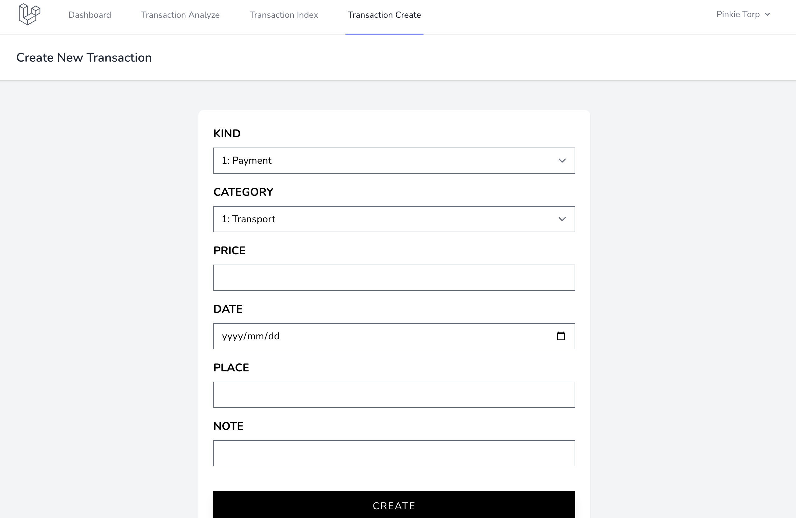
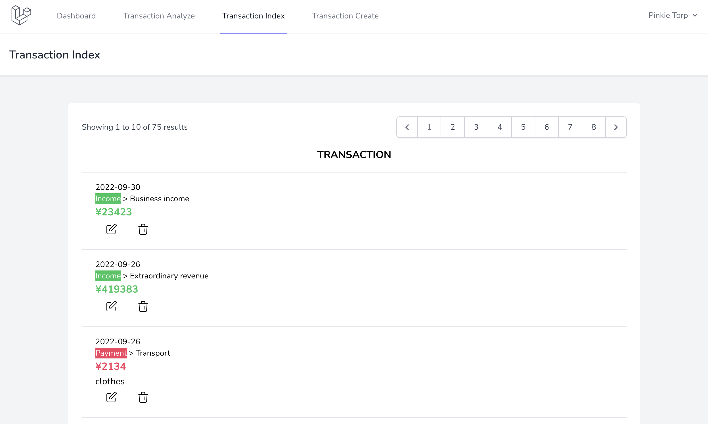
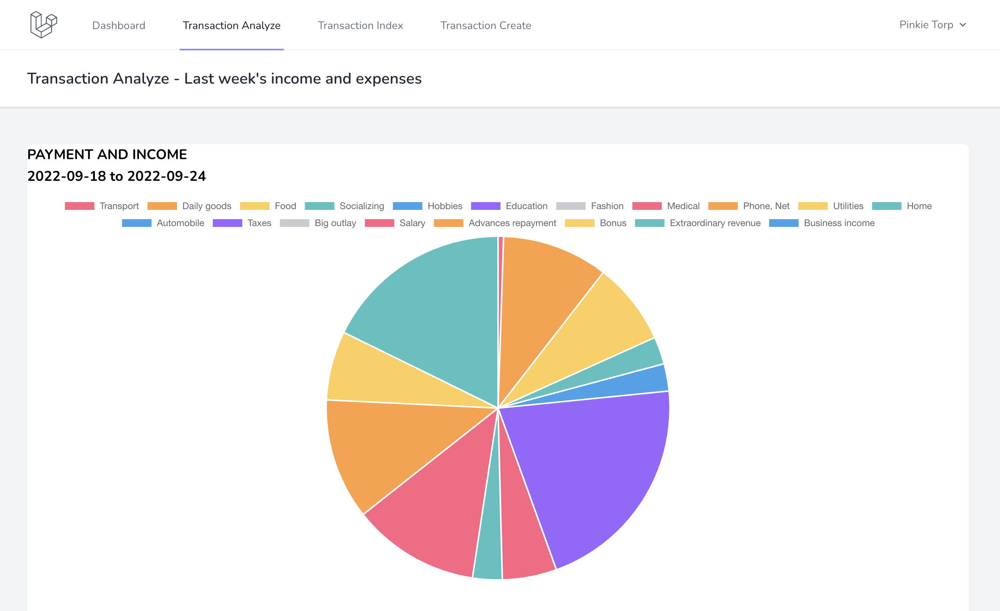
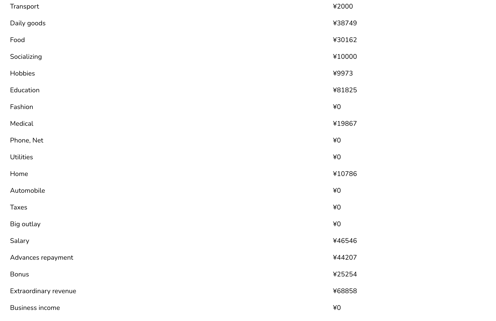

<!-- # TODO
- [x] chartjs 導入
- [x] ページネーション
- [x] 非同期通信（GET）
- [ ] chartjs 収入と支出のグラフ
- [ ] chartjs 週，月，年ごとのグラフ
- [ ] 非同期通信（POST）
- [ ] 色々アイコン追加
- [ ] 必須入力フィールドにマーク
- [ ] chartjs カテゴリー別のグラフ -->

# About this repository
Laravelを使用して家計簿を作成．

This repository for 家計簿 Kakeibo (household accounts in Japanese) web application
using Laravel (PHP framework).
This application allows you to record and analyze your daily income and expenses.

# 動画のファイル名
`DEC_Phase01/20/20_kakeibo.mov`

# ページの説明
- Transaction Create: 収入支出の記録を作成

- Transaction Index: 収入支出の記録一覧

- Transaction Analyze: 収入支出の記録を分析



# 工夫した点
- JavaScriptと連携し，Transaction Createページのセレクトボックスを動的に変更できるよう実装した
    - Kind（PaymentかIncome）の入力値に応じてCategoryの選択肢を変動させるようにした
- Transaction Indexページでページネーションを実装した
- {{ old('name') }}ヘルパーを使用して，バリデーションエラーが生じても直前の値を保持できるようにした
- Chartjsを導入し，先週の収入支出を可視化した

# 使用した技術
- Framework
    - Laravel (PHP framework)
- Design
    - Tailwind CSS
- Chart
    - chart.js
<!-- - Asynchronous communication
    - axios -->


# 開発時のメモ
## Seed data
```
sail php artisan migrate:fresh

sail php artisan db:seed --class=DatabaseSeeder && sail php artisan db:seed --class=KindsSeeder && sail php artisan db:seed --class=CategoriesSeeder && sail php artisan db:seed --class=TransactionsSeeder
```

### using faker data
To use faker data, you need to create Factory file.

```
sail php artisan make:factory TransactionFactory --model=Transaction 
```

Then you need to edit `database/factories/TransactionFactory.php`.

```.php
// TransactionFactory.php
public function definition()
{
    // https://stackoverflow.com/questions/45930892/how-to-parse-a-faker-datetimebetween-with-carbon-in-laravel
    // 過去1ヶ月間での収入支出を記録する
    $events = $this->faker->dateTimeBetween('-30 days', 'now');

    return [
        'kind_id' => $this->faker->numberBetween(1, 2),
        'category_id' => $this->faker->numberBetween(21, 38),
        'price' => $this->faker->numberBetween(1000, 50000),
        // 'date' => $this->faker->date(),
        'date' => $events->format('Y-m-d'),     // dateTimeをフォーマット変換
        'place' => $this->faker->streetName(),
        'note' => $this->faker->realText($this->faker->numberBetween(10, 20)),
    ];
}
```


```
sail php artisan make:seeder TransactionsSeeder.php
```

Then you need to edit `database/seeders/TransactionsSeeder.php`.

### manually adding seed data
To add seed data for cateogries, kinds, and transactions
you need to execute code below.

```
sail php artisan db:seed --class=KindsSeeder
sail php artisan db:seed --class=CategoriesSeeder
sail php artisan db:seed --class=TransactionsSeeder
```

If you get the error `Target class [Database\Seeders\KindsSeeder] does not exist.`,
please check if the class name in `KindsSeeder.php` is correctly named `KindSeeder`.
Also, check if there is a `use HasFactory` in `app/Models/Kind.php`

```.php
// app/Models/Kind.php
class Kind extends Model
{
    use HasFactory;
    ...
}
```

To make seed data, first export db data from phpmyadmin page,
then parse sql using selenium.ipynb which is located upper directory.


<!-- # laravel-mix
Please add line below to package.json

```
// laravel-your-project/package.json

{
    ...
    omitted
    ...
    },
    "devDependencies": {
        ...
        omitted
        ...
        "laravel-mix": "^6.0.49",
        ...
    },
    "dependencies": {
        "chart.js": "^3.9.1"
    }
}
``` -->


## Command
```
// show routing table
sail php artisan route:list | grep tweet

// show databases
sail mysql
show databases;
show tables from laratter;
use laratter;
show columns from tweets;

// update css
sail npm run build


cd resources/views
mkdir tweet
touch create.blade.php edit.blade.php index.blade.php show.blade.php
cd ../..
```
